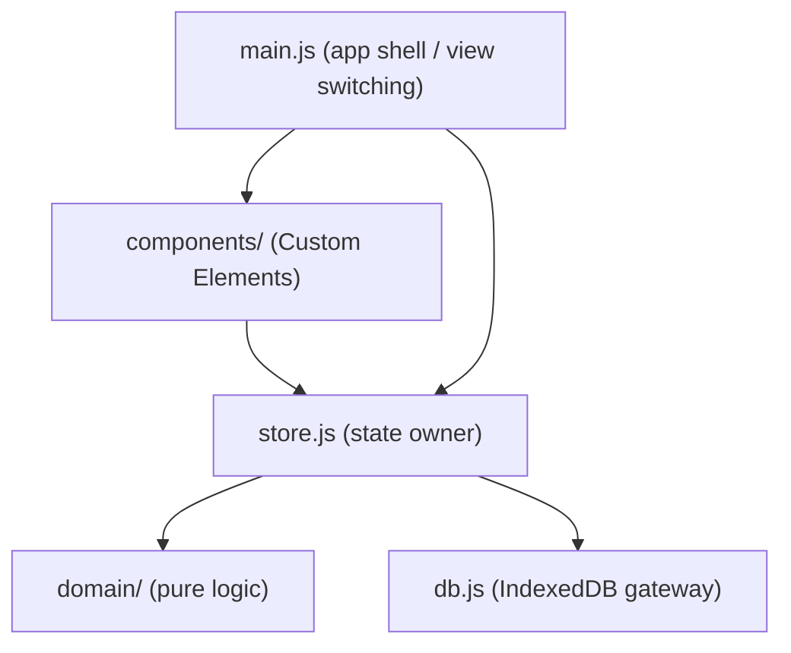

# Architecture Spine — RekenRaket

## Design Paradigm

**Store-Mediated Web Components** — a vanilla-JS, library-free variant of unidirectional data flow (Flux-lite). Four layers, each a plain ES module namespace:

- `domain/` — pure functions (no DOM, no I/O): Leitner box transitions, card generation, retry-cap logic, flight-tier calculation.
- `db.js` — the only code that touches IndexedDB; owns schema + migrations.
- `store.js` — the single owner of runtime app state (boxes, cards, session, current view); calls `domain/` and `db.js`, notifies components.
- `components/` — Custom Elements (Shadow DOM). Pure render of state + dispatch of intent; no direct DB or cross-component access.

## Invariants & Rules

### AD-1 — Single Store owns all state and is the sole gateway to persistence

- **Binds:** all app state (Leitner boxes, cards, session/run progress, settings); `4.1`–`4.5`
- **Prevents:** two components independently reading/writing IndexedDB or inventing their own copy of box-transition logic, causing divergent or corrupted state
- **Rule:** only `store.js` calls `db.js`; components never import `db.js` or call `indexedDB` directly. Components receive state via a `render(state)` call (or attribute/property set) from the Store and never mutate it in place.

### AD-2 — Domain logic is pure and DOM-free `[ADOPTED]`

- **Binds:** Leitner box transitions (FR-7, FR-8), card generation + range constraints (FR-12), retry-cap (FR-8), flight-tier calculation (FR-9)
- **Prevents:** business rules leaking into UI components (untestable without a browser, and liable to drift between components that each reimplement a slice of it)
- **Rule:** every function in `src/domain/` takes and returns plain data, has no DOM/IndexedDB/async dependency, and is exercised directly by `node:test` unit tests.

### AD-3 — No shipped frameworks or libraries `[ADOPTED]`

- **Binds:** everything under `src/` (shipped app code)
- **Prevents:** two features pulling in different helper libraries and diverging on state/rendering patterns; unbounded dependency surface for a single-maintainer hobby app
- **Rule:** shipped code uses only standard Web Platform APIs (Custom Elements, Shadow DOM, ES modules, IndexedDB). No `npm` package is ever imported by anything under `src/`. Dev-only tooling (test runner, browser automation) is exempt and lives in `devDependencies`, never bundled or shipped.

### AD-4 — Components communicate only through the Store, via events up / render down

- **Binds:** all custom elements under `src/components/`
- **Prevents:** components reaching into each other's internals, sharing ad hoc globals, or bypassing the Store to talk to a sibling directly
- **Rule:** a component dispatches a `CustomEvent` (`{bubbles: true, composed: true}`) to signal intent (e.g. an answer submitted); the Store is the only listener that acts on it and then re-renders affected components. No component holds a reference to another component's instance. Every event's `detail` is a flat object keyed `{ id, ...primitives }` (the affected domain id first, e.g. `{ id: cardId, value }`) — a component never invents its own shape, so the Store's handlers don't need per-component parsing.

### AD-5 — IndexedDB schema has exactly one owner

- **Binds:** persistence for boxes, cards, session state, settings
- **Prevents:** two code paths independently calling `indexedDB.open()` / `onupgradeneeded`, racing on schema version or drifting on object-store shape
- **Rule:** `src/db.js` is the only module that opens the database; it owns the single `onupgradeneeded` migration chain and exposes typed CRUD functions consumed exclusively by `store.js`.

### AD-6 — No offline/service-worker support in v1

- **Binds:** the PRD's open "offline" question
- **Prevents:** a half-built, unmanaged service worker causing stale-cache bugs worse than no offline support at all
- **Rule:** no service worker is registered. The app requires network on load; installability is limited to a home-screen icon (manifest + `apple-touch-icon`), not true offline operation. Revisit if network reliability at point of use becomes a problem (see Deferred).

### AD-7 — UI sub-elements render as internal Shadow DOM fragments, not separate Custom Elements

- **Binds:** `rr-keypad`, `rr-run-progress`, `rr-settings-row` (named in `EXPERIENCE.md` Component Patterns) — UI patterns each used within exactly one screen-level component
- **Prevents:** two stories independently deciding whether a UX-named component pattern needs its own Custom Element and file, fragmenting the four-screen structure into an unbounded number of files with no reuse to justify it
- **Rule:** a UX-named component pattern gets its own top-level Custom Element under `src/components/` only if it's rendered from more than one screen-level component; otherwise it's plain DOM rendered inside its parent screen component's `render(state)`, styled within that parent's Shadow DOM. `rr-keypad` and `rr-run-progress` render inside `rr-run-view.js`; `rr-settings-row` renders (repeated) inside `rr-settings.js`.

### Dependency direction



No arrow ever points backward: `domain/` and `db.js` never import `store.js` or `components/`; `components/` never import `domain/` or `db.js` directly.

## Consistency Conventions

| Concern | Convention |
| --- | --- |
| Naming | Custom element tags prefixed `rr-` (e.g. `rr-fuel-tanks`); files kebab-case matching the tag/module they define. |
| Events | `CustomEvent` names are lowercase, no dashes, per DOM convention (e.g. `cardanswered`, `runcompleted`, `liftoffdismissed`). |
| Data & formats | Card id = `{operation}:{operandA}:{operandB}` (stable, deterministic, doubles as an IndexedDB key). Dates/timestamps stored as ISO 8601 strings. |
| State & cross-cutting | All state mutation goes through `store.js` action-style functions (e.g. `submitAnswer(cardId, value)`); components never set state fields directly. Retry cap (3) and box count (5) are named constants in `src/domain/`, not magic numbers scattered across components. |
| Styling | Text sizing uses `rem`, never fixed `px`, so the OS Dynamic Type setting is honored (`DESIGN.md` Typography). Any animation (e.g. Liftoff) is wrapped in `@media (prefers-reduced-motion: reduce)`, collapsing to the end state instantly when set. |

## Stack

| Name | Version |
| --- | --- |
| iPadOS / Safari (target runtime) | iPadOS 26 (WebKit engine) |
| JavaScript | ES2022+ native ES modules (`<script type="module">`), no bundler/build step |
| Persistence | IndexedDB (native browser API, no wrapper library) |
| Node.js (dev/test only) | v24 (Active LTS) |
| Test runner (unit) | `node:test` (Node built-in, zero deps) |
| Test runner (e2e) | Playwright 1.63, WebKit project only (matches Safari/iPadOS engine) |
| Hosting | GitHub Pages (static hosting, HTTPS by default) |

## Structural Seed

```text
/
  index.html                  # single entry point, loads main.js as a module
  manifest.webmanifest        # name/icon for "Add to Home Screen" (no service worker)
  src/
    main.js                   # app shell: wires store.js + components, owns view switching
    store.js                  # sole owner of runtime state; calls domain/ and db.js
    db.js                     # sole owner of IndexedDB schema/migrations
    domain/
      leitner.js               # box transition rules (FR-7, FR-8)
      card-generator.js         # per-operation fact generation + range constraints (FR-12)
      tiers.js                  # flight tier calculation (FR-9)
    components/
      rr-fuel-tanks.js
      rr-run-view.js           # renders keypad + run-progress internally (AD-7)
      rr-liftoff.js
      rr-settings.js           # renders settings rows internally (AD-7)
    styles/
      base.css
  tests/
    unit/                      # node:test against src/domain/
    e2e/                       # Playwright (WebKit) against real DOM + IndexedDB
```

## Capability → Architecture Map

| Capability / Area | Lives in | Governed by |
| --- | --- | --- |
| 4.1 Fuel-Tank Progress Visualization | `components/rr-fuel-tanks.js`, `store.js` | AD-1, AD-4 |
| 4.2 Daily Practice Session & Batching | `store.js`, `components/rr-run-view.js` | AD-1, AD-4 |
| 4.3 Answer & Retry Mechanic | `domain/leitner.js`, `store.js` | AD-1, AD-2 |
| 4.4 Daily Liftoff & Flight Tiers | `domain/tiers.js`, `components/rr-liftoff.js` | AD-2, AD-4 |
| 4.5 Math Content Configuration | `domain/card-generator.js`, `db.js`, `components/rr-settings.js` | AD-1, AD-2, AD-5 |

## Deferred

- **True offline / service worker.** Rejected for v1 (AD-6); revisit if classmates' installs hit unreliable network at point of use.
- **Multi-device sync / backend.** Permanent non-goal per PRD — each install is independent and single-child.
- **PIN-lock on settings.** Deferred per PRD (FR-13); no auth boundary needed in v1.
- **CI pipeline specifics.** Hosting is settled (GitHub Pages); whether/how tests run automatically on push (e.g. GitHub Actions) is left open.
- **Detailed IndexedDB schema (object stores, indexes, exact field shapes).** Owned by `db.js` once written; the spine fixes only that it has one owner (AD-5), not the shape.
- **Accessibility specifics** (contrast, focus order, screen-reader labeling for a 7-year-old reader). Not raised in the PRD; worth a pass once components exist.
